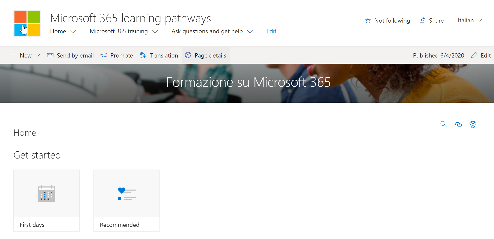

# 翻译网站页面
在开始翻译学习路径网站之前，请务必了解多语言功能如何与学习路径配合使用的几个关键概念。 
- 网站信息导航、徽标和网站名称转换要求在用户的语言配置文件中查看和翻译网站。  
- 必须使用用户的语言配置文件查看 "学习路径" Web 部件，以使其以非英语语言显示。 Web 部件和 Microsoft 提供的内容已为你进行了翻译。 有关语言配置文件的详细信息，请参阅[更改您的个人语言和区域设置](https://support.microsoft.com/en-us/office/change-your-personal-language-and-region-settings-caa1fccc-bcdb-42f3-9e5b-45957647ffd7)。
- 设置学习路径的方式决定了是否有已翻译的页面可用。 使用 Microsoft 365 "查看书籍" 服务预配的新网站将使用九种语言翻译的页面。 您创建的更新的网站或网站需要手动翻译。 有关[多语言学习路径，请参阅安装程序选项](custom_setupoptions_ml.md)。
- 针对通信网站的 SharePoint Online 多语言功能启用了对学习路径的多语言支持。 若要了解 SharePoint Online 多语言功能，请参阅[创建多语言通信网站、页面和新闻](https://support.office.com/article/2bb7d610-5453-41c6-a0e8-6f40b3ed750c)。 

## 使用新预配的网站
如果您从 Microsoft 365 的 "查阅" 书籍服务中设置了新的学习路径网站，则已为您提供已翻译的页面。 默认情况下，网站提供以下页面：

- 主页 .aspx
- Start-with-Six-Simple-Steps
- Get-started-with-Microsoft-365
- Get-started-with-Microsoft-Teams
- Get-started-with-SharePoint
- Get-started-with-OneDriive
- Ask-questions-and-get-help
- 培训活动的日历 .aspx
- Become-a-Champion
- Recommended-Playlists
- 学习路径管理成功中心

## 从新设置的网站查看翻译的页面
若要熟悉已翻译的学习路径网站，我们来看看几个翻译页面。

### 查看翻译的主页
从 "学习路径" 主页中，从语言下拉列表中选择一种语言，如下例中所示。 在本示例中，您将看到在右上角选择了 "意大利语"，并翻译了所有页面元素。

### 查看翻译后的 Microsoft 365 培训页面
现在，我们来看看 Microsoft 365 培训页面。 

1. 从 "学习路径" 网站**主页**中，单击 " **Microsoft 365 培训**"。
2. 在页面的右上角，选择一种语言。 在此示例中，选择 "意大利语"。

在选择语言时哪些翻译是可见的？
- 将转换 SharePoint 页面，如上面的图形所示。 请注意，页面横幅的文本现在用意大利语表示。

什么翻译不可见？
- 网站名称为英语
- 网站导航为英文版
- "学习路径" web 部件是英文的

## 查看完全翻译的网站 
若要以特定语言（包括网站页面、导航和 web 部件）查看完全翻译的网站，必须为该语言设置用户的个人语言和区域设置。 有关设置语言和区域设置的详细信息，请参阅[更改您的个人语言和区域设置](https://support.microsoft.com/en-us/office/change-your-personal-language-and-region-settings-caa1fccc-bcdb-42f3-9e5b-45957647ffd7)。 建议使用单独的帐户或让另一个具有不同语言设置的用户查看已翻译的页面。  

## 使用已更新或手动安装的学习路径网站
如果已更新现有学习路径网站或将 web 部件手动安装到现有网站，则需要手动转换网站页面。 "学习路径" web 部件和内容已翻译，并将以用户的首选语言显示。 若要翻译页面，请参阅以下说明 "创建所需语言的页面"。 

## 创建所需语言的页面
一旦为您的网站启用了多语言功能，并选择了要使其可用的语言后，就可以创建所需的翻译页面。 

1. 转到要使其可用于其他语言的默认语言页面。
2. 在顶部栏上，选择 "**翻译**"。
3. 为所需的语言选择 "**创建**"。

> [!IMPORTANT]
> 创建翻译页面后，必须发布（或重新发布）默认语言页面，以确保：
>- 翻译页面显示在相应的语言网站中。
>- 在新闻 web 部件和突出显示的内容 web 部件中正确显示翻译页面。
>- 网站顶部的语言下拉列表中包含您启用的所有语言。
>- 翻译者将收到有关翻译请求的通知。

创建页面后，页面的状态（"草稿"、"已发布"、"已发布" 等）将显示在每种语言旁边的 "转换" 窗格中。 此外，还将通过电子邮件通知你分配的翻译人员请求翻译。

### 以特定语言查看完全翻译的网站
若要以特定语言（包括网站页面、导航和 web 部件）查看完全翻译的网站，必须为该语言设置用户的个人语言和区域设置。 有关设置语言和区域设置的详细信息，请参阅[更改您的个人语言和区域设置](https://support.microsoft.com/en-us/office/change-your-personal-language-and-region-settings-caa1fccc-bcdb-42f3-9e5b-45957647ffd7)。 请注意，最好使用单独的帐户或让另一个具有不同语言设置的用户查看已翻译的页面。

## 翻译工具有什么用途？
 在使用英语设置网站后，以西班牙语作为首选个人语言的用户，例如，手动编辑标题、导航和页脚内容并将其转换为西班牙语。 以德语作为首选个人语言的用户对德语而言是一样的。 翻译完内容后，它将显示这些首选语言的所有用户。 Web 部件将选取用户的首选语言，并显示用该语言翻译的内容。 

翻译人员将默认语言页面的副本手动转换为指定的语言。 在创建页面副本时，如果指定了转换器，则会在电子邮件中通知翻译人员。 该电子邮件包含指向默认语言页面和新创建的翻译页面的链接。 转换器将：
1. 选择电子邮件中的 "**开始翻译**" 按钮。
2. 在页面右上部选择 "**编辑**"，然后翻译内容。
3. 完成后，选择 "**保存为草稿**" （如果您未准备好使其对读者可见），或者，如果页面已准备好供在网站上使用该语言的所有用户查看，请选择 "**发布**或**发布新闻**"。

有关转换过程的详细信息，请参阅[创建多语言通信网站、页面和新闻](https://support.office.com/en-us/article/2bb7d610-5453-41c6-a0e8-6f40b3ed750c)。 

## 更新默认语言页面
更新 "默认语言" 页面后，必须重新发布页面。 然后，在电子邮件中通知翻译页面的转换器，以电子邮件的形式通知您已进行更新，以便可以对各个翻译页面进行更新。

## 设置多语言网站名称、导航和页脚
若要以您所提供的不同语言显示网站的名称、导航和页脚，必须手动翻译每个网站名称。

例如，假设您使用英语默认语言创建了一个通信网站，并且您为西班牙语和德语的语言启用了该网站。 创建网站时，将使用默认语言（在此示例中为 "英语"）设置网站名称和说明。 您还可以在创建网站后更新网站名称和说明。 然后，用英语创建导航节点和页脚内容。

在使用英语设置网站后，以西班牙语作为首选个人语言的用户将手动编辑标题、说明、导航和页脚内容并将其转换为西班牙语。 以德语作为首选个人语言的用户对德语而言是一样的。 翻译完内容后，它将显示这些首选语言的所有用户。 

> [!NOTES
>- 翻译首选语言的网站内容的用户应是网站的 "所有者" 组的成员，或者具有同等的网站权限。
>- 如果在默认语言中对网站名称、导航或页脚进行了更改，则其他语言的相应翻译项不会自动更新，除非您选择覆盖现有网站翻译。 如果这样做，则已翻译的项目将替换为默认语言的更新，并且必须再次手动翻译。 若要覆盖翻译，请转到默认语言的 "网站语言" 页面，然后选择 "显示高级设置"。 然后，将切换为 "覆盖转换为打开"。 此选项不适用于 "页面" 或 "新闻" 内容。

### 以特定语言查看完全翻译的网站
若要以特定语言（包括网站页面、导航和 web 部件）查看完全翻译的网站，必须为该语言设置用户的个人语言和区域设置。 有关设置语言和区域设置的详细信息，请参阅[更改您的个人语言和区域设置](https://support.microsoft.com/en-us/office/change-your-personal-language-and-region-settings-caa1fccc-bcdb-42f3-9e5b-45957647ffd7)。 建议使用单独的帐户或让另一个具有不同语言设置的用户查看已翻译的页面。

## 详细信息
- 有关转换 SharePoint 通信网站页面的详细信息，请参阅[创建多语言通信网站、页面和新闻](https://support.office.com/en-us/article/2bb7d610-5453-41c6-a0e8-6f40b3ed750c)。
- 有关自定义学习路径的详细信息，请参阅[自定义学习路径](custom_overview.md)。  
