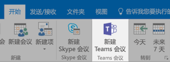
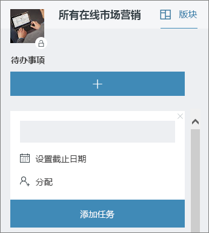

# 办公室会议Meeting at the Office

会议时间为 10:00 AM 和时间。It's 10:00 AM and time for your meeting. 在本节中, 我们将向您展示如何提高会议效率。In this section, we'll show you how to make your meetings more productive.  这涉及会议准备和 Office 365 工具的最佳实践。This involves best practices for meeting preparation and Office 365 tools.  

## 工具Tools
- OutlookOutlook
- Microsoft TeamsMicrosoft Teams
- Skype for BusinessSkype for Business
- OneNoteOneNote

## 会议的检查表Checklist for your meeting
- 规划和预订会议Plan and book your meeting
- 加入会议Join a meeting
- 在会议中显示信息Present information in a meeting
- 在会议中使用 OneNote 创建共同创作和笔记Use OneNote in a meeting for co-creation and notes
- 在会议中使用 Planner 来跟踪该项目的交办事项Use Planner in a meeting to track action items for that project
- 结束会议End a meeting
 
## 规划和预订会议Plan and book your meeting
您可以执行一些操作以确保您的会议尽可能提高工作效率:There are a few things you can do to ensure your meeting is as productive as possible:

1. **您是否需要会议？****Do you need a meeting?** 首先, 考虑与必要的审批者共享聊天中的文件。Consider sharing a file in chat with the necessary approvers first.  
1. **明确安排。****Have a clear agenda.**  在联机会议邀请的 "备注" 部分中加入会议议程, 以便与会者可以做好准备。Include your meeting agenda in the notes section of your online meeting invitation so attendees can be prepared.
1. **录制会议** 在 Microsoft 团队中使用会议录制功能, 与无法参加会议的人共享会议或稍后 transcribe 笔记。**Record your meeting**  Use meeting recording functions in Microsoft Teams to share the meeting with people who could not attend or to transcribe notes later.  

现在您已准备好预订该会议: 在 Outlook 中预订与 Microsoft 团队会议或 Skype for business 详细信息。Now you're ready to book that meeting:  Book the meeting with Microsoft Teams or Skype for Business details in Outlook. 这样做使您能够将团队成员包括在不同的位置, 记录会议并利用视频 (如果可用) 以增强通信。Doing so enables you to include team members from different locations, record the meeting and utilize video (when available) to enhance communication. 

## 加入会议Join a meeting
从任意位置加入。Join from anywhere. 通过在会议详细信息或使用移动应用程序中调用拨入号码, 可以从任何位置使用移动设备加入 Microsoft 团队或 Skype for business 会议。It is possible to join a Microsoft Teams or Skype for Business meeting from anywhere using a mobile device, either by calling the dial-in number in the meeting details or using the mobile apps. 在使用移动应用程序时, 请注意适用于您或您所在国家/地区的移动数据使用限制。When using the mobile apps, be conscious of mobile data usage limits that apply to you or your country.

> [!TIP]
> **使用耳机。****Use a headset.** 如果是从你的办公桌上的计算机连接, 请使用耳机 (而不是计算机的内置麦克风和扬声器), 以确保更好的呼叫质量。If you are connecting from your computer at your desk, use a headset rather than your computer's built-in microphone and speakers to ensure a better call quality.

> [!TIP]
> 打开视频!Turn on your video! 当相机可用时, 可以使用它们, 因为面对面通信提供了在使用语音时可能会丢失的非口头提示。When cameras are available, it's worth using them, as face-to-face communication provides non-verbal cues that can be missed when just using voice. 别担心, 你的头发看起来很棒。Don't worry, your hair looks great. 

## 在会议中显示信息Present information in a meeting
从你的设备共享内容是重点关注会议并为讨论提供上下文的绝佳方式。Sharing content from your device is a great way to focus your meeting and provide context to the discussion. 通常情况下, 共享整个屏幕可能是一个不好的想法。In general, sharing your entire screen can be a bad idea. 这意味着, 屏幕上显示的所有内容都将显示在参加会议的每个人的屏幕上。It means that everything that comes up on your screen will appear on the screens of everyone attending the meeting. 只需选择要在 Microsoft 团队中共享的内容, 即可避免这种情况。Avoid this by simply selecting the content you want to share in Microsoft Teams. 

## 在会议中使用 OneNoteUse OneNote in a meeting
OneNote 可以实现实时协作和共同创建, 使其成为灵感触发的理想工具和会议中的笔记记录。OneNote can allow for real-time collaboration and co-creation, making it an ideal tool for brainstorming and note taking in meetings. 只要每个人都有权访问 OneNote 的共享位置, 您就可以发布指向该笔记本的链接并立即启动灵感触发。As long as everyone has access to the location where the OneNote is shared, you can post a link to the notebook and start brainstorming right away.

你可以在团队笔记本中为会议笔记创建特定分区。You can create a specific section for meeting notes in the team notebook. 您还可以使用 OneNote 中的 "会议详细信息" 功能创建包含会议详细信息摘要的页面。You can also use the "meeting details" functionality in OneNote to create pages with a summary of the details of the meeting.

## 在会议中使用 PlannerUse Planner in a meeting
将交办事项直接添加到项目的计划中可使您在事实之后将其转录。Directly adding action items into a plan for your project saves you from transcribing them after the fact. 在大型项目会议中, 最佳做法是将某人分配到行动跟踪 &, 以进行笔记记录。It's a best practice in large project meetings to assign someone to action tracking & note taking. 这通常与运行会议的个人不同。This is normally a different person than the individual running the meeting. 操作项提醒将直接发送给其被分配为的个人, 如果项目通过其到期日期, 则为提醒。Action item reminders are sent directly to the individual to whom it is assigned as are reminders if the item passes it's due date. 

## 结束会议End a meeting
如果讨论了议程上的所有内容, 请结束会议, 而不考虑时间。When everything on the agenda has been discussed, end the meeting, regardless of the time. 向所有参与者分配操作项并向其发送操作项。Assign and send action items to all participants. 如果要在 Microsoft 团队中进行协作, 可以轻松地在相应的频道中共享交办事项。If you are collaborating in Microsoft Teams, you can easily share action items in the appropriate channel. 还可以在会议期间在 Planner 中输入和分配操作项目, 从而提供了跟踪完成的快速方法,[在 Microsoft 团队中](https://support.office.com/en-us/article/use-planner-in-microsoft-teams-62798a9f-e8f7-4722-a700-27dd28a06ee0)也可以进行访问。Action items can also be entered and assigned in Planner during the meeting, providing a fast way to track for completion which can also be [accessed in Microsoft Teams](https://support.office.com/en-us/article/use-planner-in-microsoft-teams-62798a9f-e8f7-4722-a700-27dd28a06ee0). 